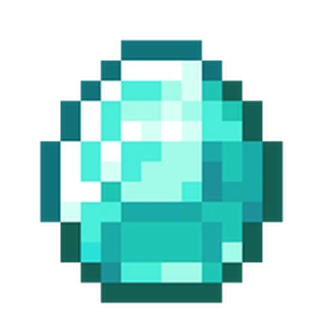

# 🥔 Kamote Server

<figure><figcaption>
Players in front of the <a href="the-justice-system/kamorte-suprema/">Kamorte Suprema</a> at sunrise | August 02, 2025
</figcaption></figure>

## About Us 🥔

We are a **Philippine-based** 🇵🇭 Minecraft SMP whose ideals center on preserving the **vanilla aspects** of the game through **genuine** player-to-player relationships! We're more than just an SMP, **we're a family** that helps each other grow, and our compassion extends beyond the borders of the game! _**Tara, laro tayo!**_

<h4 align="center"><em><strong>“Let the game be our world, and the friendships our legacy.”</strong></em></h4>

— Kamote Server Motto

## What Makes Us Stand Out 🌟

### Our Principles 📜

* We are committed to preserving the **original vanilla experience** of Minecraft, so our quality-of-life commands are light-weight. We refrain from adding overpowered features such as custom enchantments, flight commands, etc.
* Some convenient quality of life commands do exist such as `/home` and `tpa`, but are reserved for higher ranks so that new players get to experience true vanilla Minecraft first.

### Our Economy 🪙

* The most iconic Kamote Server feature is its simplistic economy system. Our currency centers around the , where **one**  **is equal to $1** in in-game currency.
* Despite the presence of an economy, we do not have admin shops or any command-based marketplace. All shops are operated by players to preserve organic trade between them.

### Our Relationships 🤝

* We want the best experience for players and help them establish a community they can call their own. The community shall be built on
  &#x20;cooperation, fairness, and mutual respect.
* We **do not allow** PvP, griefing, or stealing in the server. This is to ensure that the relationships between all players remain healthy.

### Our Justice System ⚖️

* We resolve disputes and conflicts in the most objective way—by holding court trials just like in real life! Players convicted of crime is summoned to the [Kamorte Suprema](the-justice-system/kamorte-suprema/) to face a judge and a jury and hear out their case.
* The [Kamonstitution](the-justice-system/the-kamonstitution.md) is the server's constitution that legally binds all its laws, ideals, and principles! It deliberately explains all the technicalities on what's good and bad in the server.

## Kamote Socials 🔗





