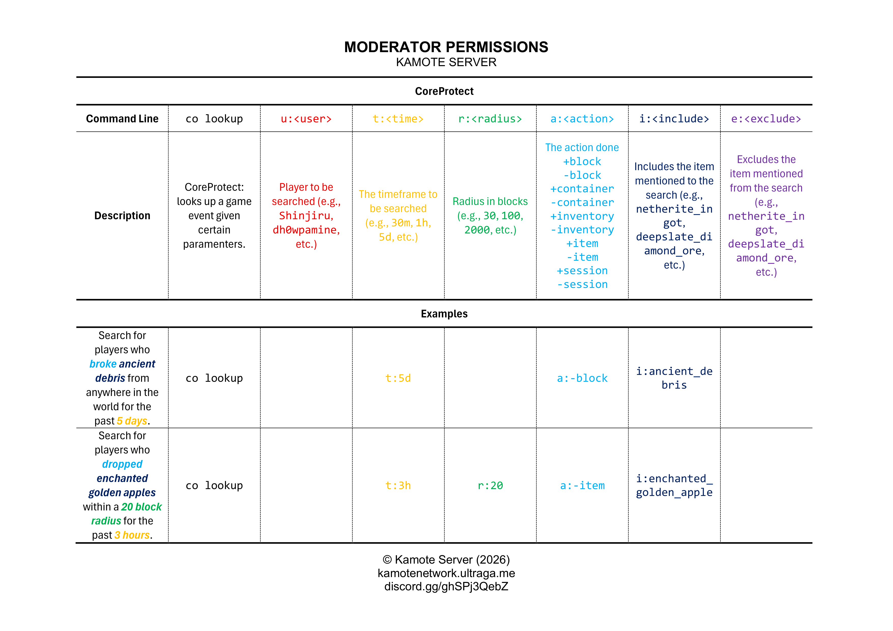
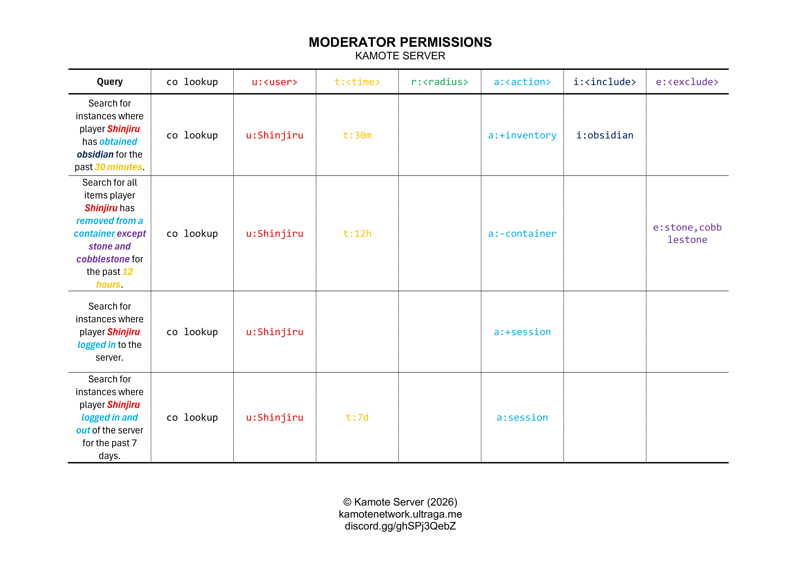

# 🔍 CoreProtect Arguments

The CoreProtect `/co lookup` command line may be followed by the following arguments:

* `u:<user>` - player to be searched
* `t:<time>` - timeframe to be searched
* `r:<radius>` - radius in blocks
* `a:<action>` - action to be searched
* `i:<include>` - item included in the search
* `e:<exclude>` - item excluded from the search

These arguments may be written **in any order**.

## Examples

<mark style="color:red;">C</mark><mark style="color:orange;">o</mark><mark style="color:yellow;">l</mark><mark style="color:$success;">o</mark><mark style="color:blue;">r</mark><mark style="color:purple;">-</mark><mark style="color:$primary;">c</mark><mark style="color:$success;">o</mark><mark style="color:yellow;">d</mark><mark style="color:orange;">e</mark><mark style="color:$danger;">d</mark> examples para sa mga bad—

<figure><figcaption></figcaption></figure>

<figure><figcaption></figcaption></figure>
