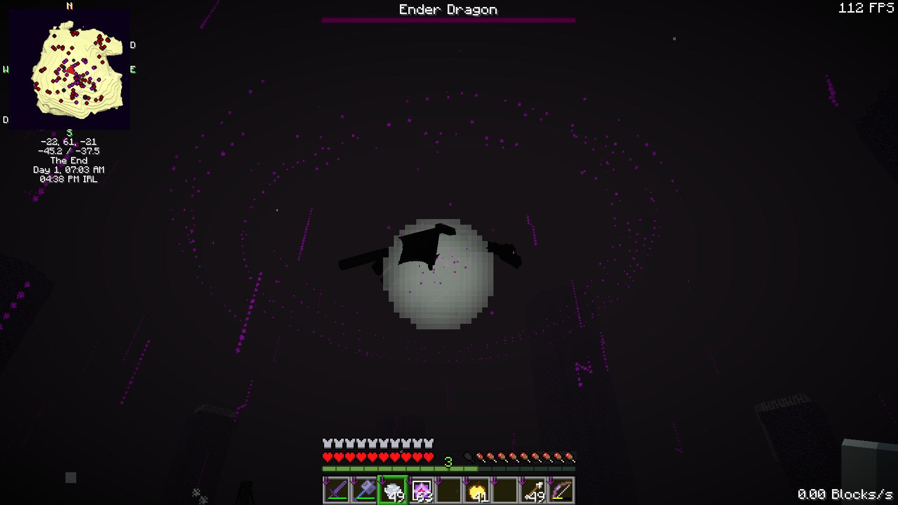

# 🐲 Ender Dragon on Steroids!

<figure><figcaption></figcaption></figure>

* Ender Dragon Health has increased from 200 HP to 500 HP
* During the Ender Dragon boss fight, boss music now plays to all players at the center island
* Ambient particles now surround the arena and players during the Ender Dragon fight
* Added a dragon dive attack that creates a huge shockwave when the Ender Dragon hits the ground
* Additionally, a variant where it performs 3 dives (Triple Dive) when perching at 75% health or lower
* Added a chain fired Dragon Fireball attack
* Added a huge laser attack
* Added a final phase where the Ender Dragon hovers above the ground for the player to levitate and deal the last blow mid air
* Caged end crystal towers are now broken in a more intuitive way: A phantom guards it and when the phantom is killed, the cage is broken
* At 10% HP the Ender Dragon will be immune to damage till perched. If not already perched or about to perch, it will forcefully perch after 30 seconds
* Added an End Crystal counter when an End Crystal is broken displaying how many are left to break
* Everyone within 128 blocks of the center end island now receives the "Free the End" advancement after defeating the Ender Dragon
* Ender Dragon respawn animation revamped
* When the Ender Dragon is respawned, a sound is played globally to all players in the end dimension
* Dragon Breath/Area Effect Clouds from Dragon Fireballs duration increased from 30 seconds to 1 minute
* Dragon Fireballs now deal damage directly on impact
* Dropped Ender Pearls break from new Ender Dragon attacks (this is to prevent obtaining massive amounts of Ender Pearls from the Enderman killed during the fight)
* Ender Dragon knockback resistance has been increased massively to prevent arrows from locking the dragon mid-air before perching
* End Crystal fire is now soul fire
