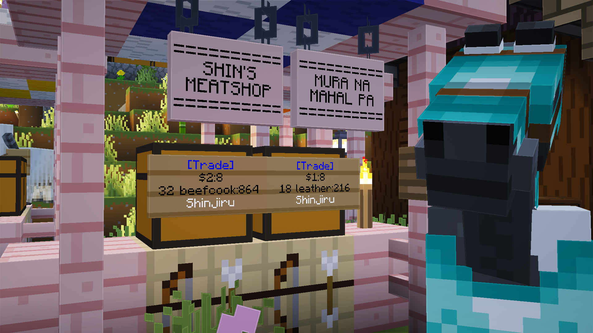

# 🛍️ Shops

A **shop** is basically just a **sign** with **specific syntax** about the item you are trying to sell and the price you want to set. You can purchase items from another player's shop by tapping on its sign.&#x20;

<figure><figcaption><p>A player with a stylized shop, selling 32 cooked beef for $2 and 18 leather for $1 (horse [probably] not for sale).</p></figcaption></figure>

Players with the  **Rank** may open their own shops anywhere in the world and sell any item at their price. There exists, however, a **standard retail price** for select goods to prevent merchants from **overpricing**. The standard retail price list can be found at ⁠⁠`#💵│srp` channel on Discord.&#x20;

***

## Setting Up Shops 🪧


Watch our [TikTok guide](https://www.tiktok.com/@kamote.server/video/7521385347972926738) if you prefer a video tutorial. Shop setup starts at timestamp `1:39`.


To create your own shop, your sign must follow this syntax:


```html
[Trade]
<sellPrice>
<amtPerSale> <item>:<amtToStock>

```


* `[Trade]`: tells the sign that it is a trade sign (required).
* `<sellPrice>`: the price (in $) per purchase.
* `<amtPerSale>`: the number of items given per purchase.
* `<item>`: the item being sold.
* `<amtToStock>`: the total amount of the item initially stocked in the sign.


`<amtToStock>` must be greater than or equal to `<amtPerSale>`, since the shop cannot sell less than one purchase worth of items.


After closing the sign editor, the sign will automatically update to:


```html
[Trade]
$<sellPrice>:0
<amtPerSale> <item>:<amtStock>
<sellerName>
```


* `0` : the collectable amount of $ from the shop (at 0 since nobody has bought from the shop yet).
* `<amtStock>`: the remaining stock of item in the sign.
* `<sellerName>`: the name of player selling the item.&#x20;

***

## Example Shop ℹ️

Suppose a player named _Shinjiru_ wants to sell 4 dirt for $1. He currently has 64 dirt in his inventory, but only wants to stock the shop with 20 dirt. He'll have to write the following on his sign:


```python
[Trade]
1
4 dirt:20

```


After closing the sign editor, his sign will look like:


```python
[Trade]
$1:0
4 dirt:20
Shinjiru
```


The 64 dirt in his inventory is now only 44, since he stocked the sign with `20` dirt. If you decide to tap/right-click on his sign once, the text on the sign will change again and look like:


```python
[Trade]
$1:1
4 dirt:16
Shinjiru
```


**What happened:**

* You have bought 4 dirt from his shop for $1.
* The `1` that was previously `0` to the right of `:` in `Line 2` means that he can collect $1 from his sign, since somebody (you) has purchased from his shop once.
  * The moment he taps/right-clicks his own sign, that $1 will go straight to his balance.
* The `16` that was previously `20` to the right of `:` in `Line 3` means that 4 dirt were removed from his sign, which you now have.

### Restocking 🔁

_Shinjiru_'s shop would eventually run out of stock after players rush in for his precious dirt. By that time, his sign would look like:


```python
[Trade]
$1:5
4 dirt:0
Shinjiru
```


His stock has become `0` (`Line 3`) and he can now collect $5 (`Line 2`) from all his sales.&#x20;

To restock, he only needs to tap/right-click the sign while holding dirt in his main hand. For every tap/right-click, he loses 4 dirt from his inventory, and the sign gains 4 dirt.

***

## Items with Long Names 🔣

Some items have names that are longer than the maximum number of characters a sign can hold in a single line. For example:

<pre class="language-py" data-line-numbers><code class="lang-py">[Trade]
$40:0
<strong>1 netherite_upgrade_smithing_template:3
</strong>Shinjiru
</code></pre>

You can use the command `/itemdb` while holding the item in your main hand to query a list of alternative names for the item called _aliases_ that will appear in chat. Some of these aliases are short enough to fit in a single line.

<pre class="language-python" data-line-numbers><code class="lang-python">[Trade]
$40:0
<strong>1 nethtemp:3
</strong>Shinjiru
</code></pre>

The shorthand `nethtemp` now fits perfectly in a single line.
