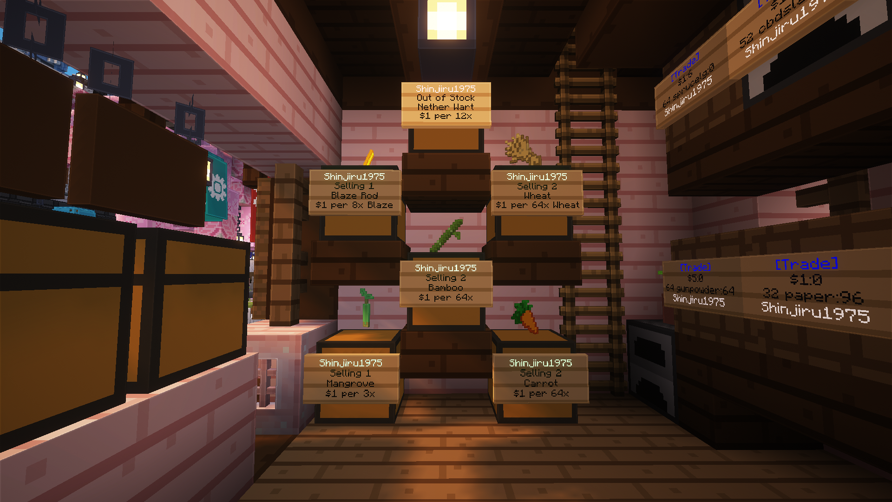

# 🛍️ Shops

Players can create their own shops to sell items to other players at prices they decide. This allows a **player-driven economy** where goods, equipment, and resources circulate naturally within the server.

The shop system now uses a **new plugin** that supports items with **NBT data**, meaning players can now sell:

* Enchanted tools and armor
* Enchanted books
* Potions with different levels
* Custom items with metadata

This greatly expands what players can trade compared to the previous shop system.

<figure><figcaption></figcaption></figure>

Players with the  **Rank** may open their own shops anywhere in the world and sell any item at their price.&#x20;

There exists, however, a **standard retail price** for select goods to prevent merchants from **overpricing**.&#x20;


[standard-retail-price.md](standard-retail-price.md)


***

## Creating a Shop 🪧

Creating a shop is simple and only takes a few steps.



### Place a Storage Block

<figure><figcaption></figcaption></figure>

Place one of the supported storage blocks (such as a **chest**).



### Hold the Item You Want to Sell

<figure><figcaption></figcaption></figure>

Hold the item in your hand.&#x20;

The **amount you hold determines how many items are sold per purchase**.



### Look at the Chest and Left Click

<figure><figcaption></figcaption></figure>

While holding the item, **look at the chest and left-click it**.&#x20;

You will be prompted in chat to **enter the price per sale**.



### Enter the Price

<figure><figcaption></figcaption></figure>

Type the price in chat and press **Enter**.&#x20;

Your shop will now be created.



### Example: Selling a Single Item 🍎

<figure><figcaption></figcaption></figure>

You want to sell **1 Golden Apple for $5**.

1. Place a chest
2. Hold **1 Golden Apple**
3. Look at the chest
4. **Left-click**
5. Type the price:

```
5
```

The shop will now sell **1 Golden Apple for $5**.

### Example: Selling Items in Batches 🍎🍎🍎

<figure><figcaption></figcaption></figure>

You want to sell **5 Golden Apples for $1**.

1. Place a chest
2. Hold **5 Golden Apples**
3. Look at the chest
4. **Left-click**
5. Type the price:

```
1
```

The shop will now sell **5 Golden Apples per purchase**.

### Adding Items to Your Shop 📥

<figure><figcaption></figcaption></figure>

To restock your shop, simply **place the items being sold inside the chest**.

If the chest becomes empty, players will not be able to purchase until it is restocked.

### Supported Shop Containers 📦

<figure><figcaption></figcaption></figure>

Shops are not limited to chests. The following blocks can also be used:

* Chest
* Barrel
* Furnace
* Blast Furnace
* Smoker
* Brewing Stand
* Dispenser
* Dropper

***

## Changing Shop Settings ⚙️

These settings help you shape your shops to your liking

### Changing the Item Being Sold 🔄

If you want to change the item in your shop:

1. Hold the new item (with the correct quantity per sale)
2. Look at the shop chest
3. Run:

```
/qs item
```

The shop will update to the new item.

### Changing the Price 🏷️

Look at the shop chest and run:

```
/qs price <newPrice>
```

Example:

```
/qs price 10
```

### Toggle the Floating Item Display 🖼️

<figure><figcaption></figcaption></figure>

Shops display a floating item above the container by default.

To hide or show it:

```
/qs toggledisplay
```

Run the command again to toggle it back on.

### Shop Management Menu 📱

<figure><figcaption></figcaption></figure>

Shop owners can access a **management interface**.

To open it:

**Sneak + Left Click the chest**

From this menu you can:

* **Freeze the shop** (temporarily disable purchases)
* **View transaction history** (see who bought items)
* **Delete the shop**

***

## Buying Items from a Shop 🛒

From a buyer’s perspective, purchasing is simple.

### Buy Normally ✅

Just **right-click the shop sign**. If you have enough money, the item will be purchased automatically.

### Preview Item Details 🔍

<figure><figcaption></figcaption></figure>

To inspect the item being sold (especially useful for enchanted items):

**Sneak + Left Click the chest**

This opens a GUI where you can **hover over the item to see its enchantments or properties**.
