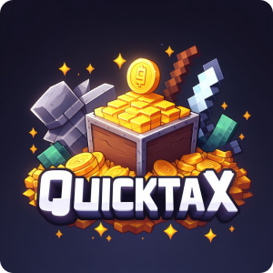

# 📈 Tax System

<figure><figcaption><p>The <a href="https://www.spigotmc.org/resources/quicktax.96495/">QuickTax</a> plugin that automatically collects tax.</p></figcaption></figure>

The server uses a **daily tax system** to help maintain a balanced economy and fund public infrastructure projects. This system is designed to prevent excessive wealth accumulation, encourage active spending, and support server-wide developments that benefit all players.&#x20;

***

## How Taxes Are Calculated 🧮

Each player’s daily tax consists of **two components**:

1. **Balance Tax**
   * **1% of your current balance**
2. **Land Tax**
   * **$1 for every 2,048 active claim blocks** you own

```coffeescript
Tax = (Current Balance × 0.01) + (Claimed Blocks ÷ 2048)
```

### Example

* Current balance: **$250**
* Claimed land area: **2,500 blocks**

```yaml
Balance Tax: 250 × 0.01 = $2.50
Land Tax:    2500 ÷ 2048 ≈ $1.22
Total Tax:   $3.72
```

***

## When Taxes Are Collected 🕛

* Taxes are **automatically collected every day at 12:00 AM PST**.
* Players do not need to take any action; deductions are handled by the server.

***

## Where the Tax Money Goes 🏦

Taxes do **not** go to a personal admin account.

* All collected taxes are deposited into a **dedicated server account**
* This account is completely separate from any player or admin balances

### Transparency 🧾

* Each tax collection cycle announces the **total amount collected** in chat.
* A daily log is posted in the `#tax-transparency` channel.

This ensures that all players can **monitor how server funds are used**.

***

## Purpose of the Tax System 🌟

### 1. Economic Balance (Anti-Inflation) ⚖️

Over time, some players accumulate large amounts of money, reducing the value and usefulness of currency. This is known as **inflation** and occurs in real-world economies as well.

The tax system:

* Removes excess money from circulation
* Encourages spending and trading
* Keeps the economy meaningful for both new and veteran players

### 2. Server Infrastructure & Services 🏢

Taxes fund **public projects**, such as:

* Roads, hubs, and transport systems
* Community buildings and event areas
* Server services and future expansions

While Minecraft resources are technically infinite, **time and effort are not**. Server funds allow the staff to focus on designing and building high-quality infrastructure that everyone can use.

***

## Automatic Diamond Conversion 

Diamonds mined on the server are **automatically converted into money**.

* Diamonds no longer remain as physical items.
* This prevents players from storing diamonds to avoid taxation.
* All wealth—whether earned through mining, trading, or selling—is immediately reflected in your balance.

Because of this system:

* **Manual tax evasion methods are no longer possible**
* Tax calculations always reflect a player’s true wealth

***
