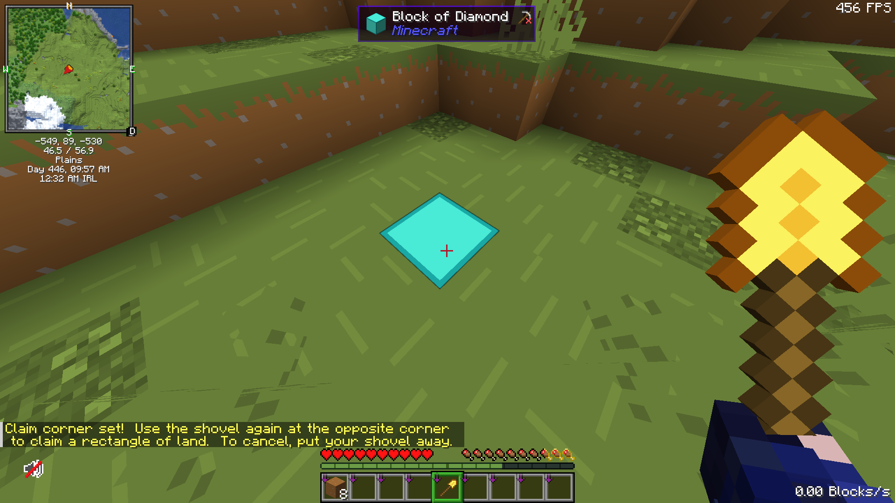
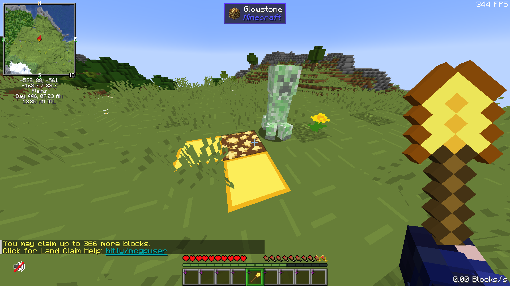
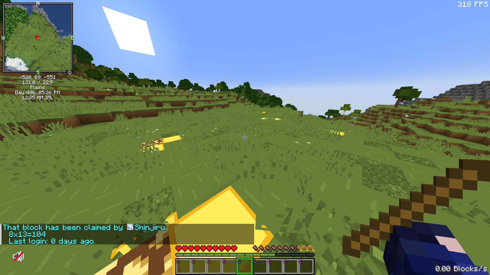

# 🏝️ Land Claiming

<figure><figcaption></figcaption></figure>

This guide will walk you through **how to claim land step-by-step**, explain how claim blocks work, and highlight important rules to keep in mind when managing multiple claims.


Watch our [TikTok guide](https://www.tiktok.com/@kamote.server/video/7521377680189607176) if you prefer a video tutorial.


***

## Who Can Claim Land 👤

Players may claim their own land upon reaching the  **Rank**. Claiming land allows you to protect your builds, storage, and valuables from other players.


Land claims are available **only in the Overworld**.


## Claim Blocks 🟨

* Claim blocks determine **how large your land claim can be**.
* You may make your claim as big as you want **as long as you have enough claim blocks**.
* Players earn 2**00 claim blocks for every 1 hour of gameplay**, simply by playing on the server.

You can use claim blocks across **multiple separate claims**, not just one.


You can hold a **Golden Shovel** to check the number of claim blocks you have.


***

## Step-by-Step: How to Claim Land ℹ️

#### Step 1: Get the Claiming Tool

Run the command:

```
/kit claim
```

This will give you a **Golden Shovel**, which is used to define your land claim.

#### Step 2: Select the First Corner

<figure><figcaption></figcaption></figure>

* Hold the **Golden Shovel**
* **Right-click** (or tap on mobile) the ground where you want the **first corner** of your claim to be

You should see the block turn into a **fake diamond block** as an indicator, meaning the first corner has been set.

#### Step 3: Select the Opposite Corner

<figure><figcaption></figcaption></figure>

* Walk to the opposite corner of the area you want to protect
* **Right-click** the ground again with the Golden Shovel

The land inside the perimeter of the two corners will now be claimed.


The perimeter of your claimed land will be outlined with **gold blocks** as indicators. The corners will also become **glowstone,** which can be used to resize your claim in the future.


#### Step 4: Claim Protection Is Active

Once your land is claimed:

* Other players **cannot place or break blocks**
* Other players **cannot open containers**
* Your builds and items are fully protected within the claim

***

## Checking if Land Is Claimed ✅

<figure><figcaption></figcaption></figure>

To check whether a piece of land is claimed:

* Hold a **Stick**
* **Right-click the ground**

This will show information about the land, including whether it is claimed, who owns it, its perimeter, and size.

***

## Customizing Your Land 🖌️

Below is a list of commands you can use to **further customize and manage your land claims**, including:

* Trusting or untrusting other players
* Allowing or restricting container access
* Adjusting permissions
* Abandoning land claims


You need to be standing inside the claim you want to modify while performing these commands.


| Commands                                        | Description                                                                      |
| ----------------------------------------------- | -------------------------------------------------------------------------------- |
| `/abandonclaim`  &#xD;                          | Abandons the claim you are standing on.                                          |
| `/abandonallclaims`&#xD;                        | Abandons all claims you’ve made.                                                 |
| `/accesstrust <player>`, `/at <player>`&#xD;    | Allows a player to only activate buttons, levers, and fence gates in your claim. |
| `/claimbook <player>` &#xD;                     | Gives the _claimbook guide_ to a player.                                         |
| `/containertrust <player>`, `/ct <player>`&#xD; | Allows a player to only access containers and villagers in your claim.           |
| `/permissiontrust <player>`, `/pt <player>`     | Allows a player to resize and give trust to other players in your claim.         |
| `/subdivideclaims`, `/sc`&#xD;                  | Allows you to further divide your claim into smaller claims.                     |
| `/transferclaim <player>` &#xD;                 | Transfers a claim to another player.                                             |
| `/trust <player>`, `/t <player>`&#xD;           | Allows a player to build, destroy, and access containers in your claim.          |
| `/trustlist`                                    | Lists all players you trusted in your claim and all their permissions.           |
| `/untrust <player>`, `/ut <player>`&#xD;        | Disallows a player to build, destroy, and access containers in your claim.       |

## Subdividing Claims 📏

<figure><figcaption></figcaption></figure>

Players may further customize their land by splitting an existing claim into smaller sections using **`/subdivideclaims`**.

Subdivided claims function independently from the main claim, meaning they can have **separate trust and permission settings**. This allows more precise access control—for example, granting access to a storage room, shop, or farm without giving permission to the entire claim.

Subdivided claims are visually indicated in-game by:

* **Iron blocks** marking each corner
* **White wool outlines** connecting the corners

These visual markers help clearly distinguish subdivided areas from the main claim and from other nearby claims.
