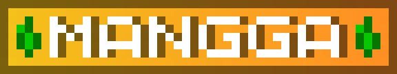
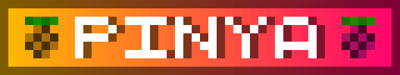

# ⏫ Ranks and Commands

The server uses a combination of **progression-based ranks** and **supporter roles**.\
Progression ranks are earned through **playtime**, while supporter roles are obtained by **supporting the server** through Discord boosts or donations.

***

## Progression Ranks ⏫

Progression Ranks are earned through **playtime** and represent a player’s **advancement** on the server, unlocking essential features and quality-of-life improvements as they continue to play and engage.

###  Rank 🥔

The default rank assigned to players upon joining the server for the first time.

* No special permissions
* Intended for learning the server mechanics

<table data-full-width="false"><thead><tr><th>Commands</th><th>Description</th></tr></thead><tbody><tr><td><code>/afk</code></td><td>Sets your status as AFK</td></tr><tr><td><code>/angelchest</code></td><td>Lists all your AngelChests and their locations</td></tr><tr><td><code>/acunlock</code></td><td>Allows your AngelChests to be opened by other players</td></tr><tr><td><code>/ar check</code></td><td>Checks your playtime and the progress of your current path(s)</td></tr><tr><td><code>/ar leaderboard</code></td><td>Checks the playtime leaderboard</td></tr><tr><td><code>/ar activate to &#x3C;path></code></td><td>Activates a path if prerequisites are met</td></tr><tr><td><code>/ar view to &#x3C;path></code></td><td>Checks the requirements of specific paths</td></tr><tr><td><code>/autosort</code>, <code>/as</code></td><td>Toggles automatic item sorting for chests and other containers</td></tr><tr><td><code>/bal</code></td><td>Checks your current money balance</td></tr><tr><td><code>/baltop</code></td><td>Checks the money balance leaderboard</td></tr><tr><td><code>/statz list &#x3C;player></code></td><td>Displays player statistics</td></tr><tr><td><code>/skin update</code></td><td>Restores your original skin (for non-cracked players)</td></tr><tr><td><code>/tpaccept</code>, <code>/tpyes</code></td><td>Accepts teleport requests to your location</td></tr><tr><td><code>/tpdeny</code>, <code>/tpno</code></td><td>Denies teleport requests to your location</td></tr><tr><td><code>/warp kamorte</code></td><td>Teleports you to the Kamorte Suprema (only available during court sessions)</td></tr><tr><td><code>/wiki</code></td><td>Sends a clickable link to this wiki</td></tr><tr><td><code>/sit</code></td><td>Sits down on any valid block</td></tr><tr><td><code>/lay</code></td><td>Lays you down on any valid block</td></tr><tr><td><code>/crawl</code></td><td>Toggles crawl mode</td></tr><tr><td><code>/spin</code></td><td>Makes you spin</td></tr><tr><td><code>/bellyflop</code></td><td>Makes you bellyflop</td></tr></tbody></table>

###  Rank 🍌

Unlocks core survival features and land ownership.

**Unique Features:**

* Can claim [land](../land-claiming.md)
* Can create player [sign shops](../economy/shops-1.md)

**Requirement:**

* **6 hours** of total playtime

| Commands                                        | Description                                                                     |
| ----------------------------------------------- | ------------------------------------------------------------------------------- |
| `/abandonclaim`  &#xD;                          | Abandons the claim you are standing on                                          |
| `/abandonallclaims`&#xD;                        | Abandons all claims you’ve made                                                 |
| `/accesstrust <player>`, `/at <player>`&#xD;    | Allows a player to only activate buttons, levers, and fence gates in your claim |
| `/claimbook <player>` &#xD;                     | Gives the _claimbook guide_ to a player                                         |
| `/claimlist`                                    | Lists all your claims and claim block details                                   |
| `/containertrust <player>`, `/ct <player>`&#xD; | Allows a player to only access containers and villagers in your claim           |
| `/permissiontrust <player>`, `/pt <player>`     | Allows a player to resize and give trust to other players in your claim         |
| `/kit claim`                                    | Gives you the claiming kit (a golden shovel and a stick)                        |
| `/subdivideclaims`, `/sc`&#xD;                  | Allows you to further divide your claim into smaller claims                     |
| `/transferclaim <player>` &#xD;                 | Transfers a claim to another player                                             |
| `/trust <player>`, `/t <player>`&#xD;           | Allows a player to build, destroy, and access containers in your claim          |
| `/trustlist`                                    | Lists all players you trusted in your claim and all their permissions           |
| `/untrust <player>`, `/ut <player>`&#xD;        | Disallows a player to build, destroy, and access containers in your claim       |
| `/itemdb`&#xD;                                  | Gives the item ID of the item you are holding, used in setting up shops         |
| `/pay  <player> <amount>` &#xD;                 | Gives a sum of money to a player                                                |
| `/payconfirmtoggle`&#xD;                        | Whether or not you will be prompted to confirm payments                         |
| `/paytoggle`                                    | Whether or not you will accept payments from other players                      |

###  Rank🥭

Adds quality-of-life and cosmetic customization.

**Unique Features:**

* Change player skin
* Hide armor (cosmetic only)
* Set **1 home**: **40-minute cooldown**

**Requirement:**

* **24 hours** of total playtime

| Commands                     | Description                                                               |
| ---------------------------- | ------------------------------------------------------------------------- |
| `/sethome <name>`            | Sets a home with a name at your location                                  |
| `/home <name>`               | Teleports you to your set home                                            |
| `/homes`                     | Lists all your homes                                                      |
| `/delhome <name>`            | Deletes your set home                                                     |
| `/togglearmor`, `/armor`     | Shows/hides your armor to you and other players                           |
| `/skin menu`, `/skins`       | Opens the skin menu                                                       |
| `/skin set <username\|link>` | Changes your skin to another player’s skin or to a skin from the internet |
| `/skin clear`                | Clears your skin to default                                               |
| `/skin favorite`             | Sets your current skin as a favorite                                      |
| `/skin favorites`            | Lists your favorite skins                                                 |
| `/skin undo`                 | Undo skin change                                                          |

###  Rank 🍍

Expands mobility and convenience while staying balanced.

**Unique Features:**

* Set multiple homes: **up to 3**
* Request teleport to other players
* Teleport cooldowns: **20 minutes**
* Open and interact with your ender chest anytime, anywhere

**Requirement:**

* **5 days** of total playtime


The player teleport and home cooldowns are in sync.


| Commands             | Description                                             |
| -------------------- | ------------------------------------------------------- |
| `/enderchest`, `/ec` | Allows you to open and interact with your ender chest   |
| `/tpa <player>`      | Issues a teleport request to a player (20 min cooldown) |
| `/tpacancel`         | Cancels player teleport request                         |

***

## Supporter Ranks 🌟

Supporter roles do **not** affect rank progression and are **not required** to access core gameplay. All perks are quality-of-life or cosmetic in nature.

**Requirement:**&#x20;

* Must have attained at least **\[MANGGA] Rank**

###  Rank 

Granted to players who support the server by boosting the Discord server.

**Unique Features:**

* Set multiple homes: **up to 5**
* Teleport cooldowns: **10 minutes**
* Custom nickname (72-hour change cooldown)
* Open up a crafting table from anywhere
* Chat messages are displayed in **purple**

**Requirement:**

* Must boost the Discord server **twice**

| Commands       | Description                                                   |
| -------------- | ------------------------------------------------------------- |
| `/hat`         | Allows you to wear the item you are holding as a hat (helmet) |
| `/nick`        | Change your nickname (only appears in chat and tab)           |
| `/craft`, `/c` | Opens up a crafting table                                     |

###  **Rank 💎**

Granted to players who financially support the server’s monthly hosting costs.

**Unique Features:**

* Set multiple homes: **up to 8**
* Teleport cooldowns: **5 minutes**
* Teleport back to death location (only once per death)
* Multiple workbench interface commands
* Chat messages are displayed in **gold**

**Requirement:**

* Must donate the required amount for the current month

| Commands                     | Description                              |
| ---------------------------- | ---------------------------------------- |
| `/anvil`, `/a`               | Opens up an anvil                        |
| `/cartographytable`, `/cart` | Opens up a cartography table             |
| `/condense`, `/cond`         | Condenses items into more compact blocks |
| `/deathback`                 | Return to your latest death location     |
| `/grindstone`, `/grind`      | Opens up a grindstone                    |
| `/loom`                      | Opens up a loom                          |
| `/stonecutter`, `/scut`      | Opens up a stonecutter                   |
| `/kittycannon`, `/k`         | Hehe...                                  |
| `/beezooka`, `/b`            | Hehehe...                                |


[how-to-become-a-donator.md](how-to-become-a-donator.md)


***

## Non–Pay-to-Win Design Philosophy ⛔

All ranks and roles follow these principles:

* No exclusive access to powerful items
* No combat advantages
* No economy manipulation
* No bypassing survival progression

Supporter perks focus on:

* Convenience
* Cosmetic features
* Reduced downtime
