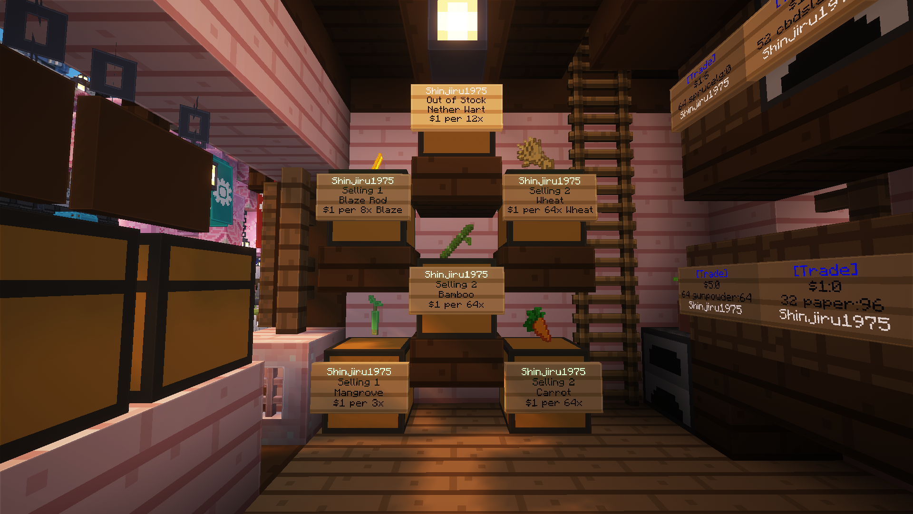

# 👤 Checking Alternate Accounts

* Use `/alts <player>` to identify accounts linked to the same IP address.
* However, players in the same household may appear as alts when using the command—this is an exemption.

<figure><figcaption>
Player <code>dh0wpamine</code> and the Geh Family.
</figcaption></figure>


This is what makes IP checks innaccurate and must, therefore, be verified further.


### **🔎 Investigation Methods**

* Observe whether accounts move independently.&#x20;
  * If one account is playing normally and the other is AFK, the AFK account is _likely_ an alt.
* Check linked Discord accounts using `/discord linked <player>`.&#x20;
  * Compare usernames and communication or chatting patterns.
* Review console join logs in `#console` if necessary.

### **🚩 Red Flags**

* Discord accounts created **on the same day** they joined the server.

<figure><figcaption></figcaption></figure>

* Identical behavior or coordinated activity.
* Simultaneous AFK behavior.

### 💡 What to Do

* If evidence is sufficient, then the case will proceed to the **Kamorte Suprema** for a proper administrative trial.

