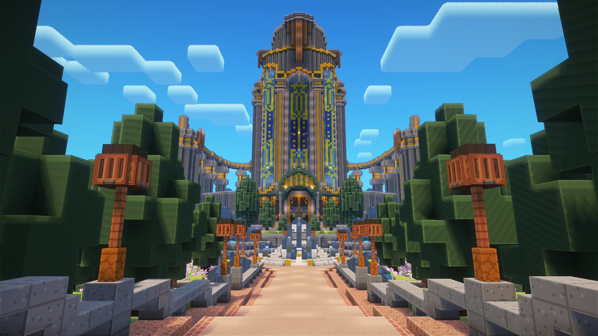

# 🏛️ Kamorte Suprema

<figure><figcaption>
The entrance path to the Kamorte Suprema.
</figcaption></figure>

The **Kamorte Suprema** is the highest court in Kamote Server, located to the west of Kamote Village in Season 1, and currently to the north of the Admin Base in Season 3. Its purpose is to resolve server-wide disputes through fair and impartial trials. Its main basis for upholding justice is [The 2025 Kamonstitution](../the-kamonstitution.md)

The court was built by server owner Shinjiru1975 and admin MadWriter29 between July 5, 2025 and July 13, 2025 (8 days). The build was a replica of the [Opera Epiclese](https://genshin-impact.fandom.com/wiki/Opera_Epiclese) building from the [Fontaine](https://genshin-impact.fandom.com/wiki/Fontaine) nation of [Genshin Impact](https://genshin.hoyoverse.com/en/home).
