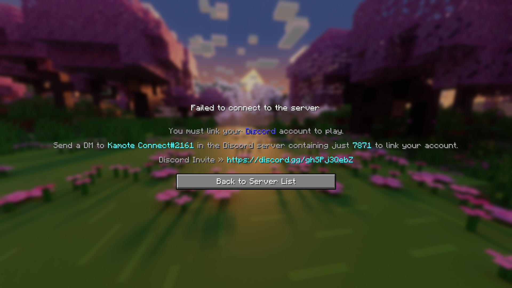
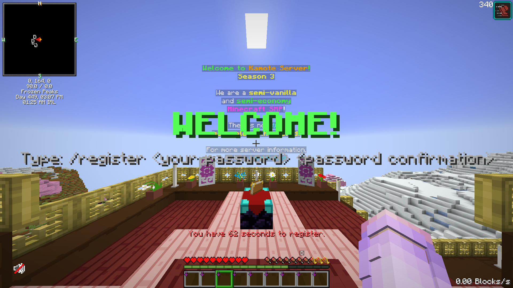

# 📥 How to Join

Follow the steps below to successfully join and set up your account on the server.



### Connect to the Server

|         IP Address         |   Port  |
| :------------------------: | :-----: |
| `kamotenetwork.ultraga.me` | `19026` |

Enter the IP and port in Minecraft and join the server as usual.





### Link Your Discord Account

<figure><figcaption></figcaption></figure>

Upon joining for the first time, you will be prompted to link your Discord account.

1. The server will give you a **four-digit verification code**.
2. Open Discord and send the code to the bot **Kamote Connect** via _<mark style="color:$danger;">**DM**</mark>_. You can mention the bot `@Kamote Connect` and _<mark style="color:$danger;">**DM**</mark>_ the code **to it.**


Do not send the code on any public channel.


4. &#x20;Once the code is verified, your Discord and Minecraft accounts will be linked.

<figure><figcaption></figcaption></figure>



### Install ClientID Mod (For Java Only)

<figure><figcaption></figcaption></figure>


If you are playing on Bedrock Edition, kindly proceed to [**Step 5**](how-to-join.md#register-your-account).


After linking your Discord account on Java Edition, you will be prompted to install the **ClientID mod**.

This mod is **required** to join the server and is used to:

* Detect prohibited mods and resource packs
* Ensure fair gameplay for all players

**🔗 Download here:** [**https://modrinth.com/plugin/client-id**](https://modrinth.com/plugin/client-id)


You **cannot join the server** without this mod installed.


<details>

<summary>How to Download Minecraft Mods</summary>

Here are some YouTube tutorials on how to download mods according to your Minecraft launcher:

* TLauncher: [https://www.youtube.com/watch?v=suvxbNRTjyM](https://www.youtube.com/watch?v=suvxbNRTjyM)
* Legacy Launcher: [https://www.youtube.com/watch?v=OMIYuQcodw4](https://www.youtube.com/watch?v=OMIYuQcodw4)
* Official Minecraft Launcher: [https://www.youtube.com/watch?v=RpN94a2q8JI](https://www.youtube.com/watch?v=RpN94a2q8JI\&t=131s)

</details>



### Remove Prohibited Mods & Resource Packs (For Java Only)

<figure><figcaption></figcaption></figure>

Once ClientID is installed, the server will check your client for disallowed modifications.

If any prohibited mods or resource packs are detected, they will be displayed on screen and you will be prevented from joining until they are removed.

#### Prohibited Mods Include (but are not limited to):

* Freecam (standard versions)
* Clear water / lava
* No fog
* Gamma / brightness utilities (e.g., Fullbright)
* Glowing ores
* X-ray
* Replay Mod / Flashback
* Autoclickers


You **cannot join the server** if you have any prohibited mods installed.


<details>

<summary>✅ <strong>Allowed Alternative to Freecam</strong></summary>

An approved alternative, **Legacy Freecam Mod**, is allowed.

* You may still detach your camera from your character
* However, you **cannot pass through solid blocks**

This preserves utility while preventing unfair advantages.

**🔗 Download here:** [**https://modrinth.com/mod/legacyfreecam**](https://modrinth.com/mod/legacyfreecam)

</details>



### Register Your Account

<figure><figcaption></figcaption></figure>

After rejoining, you must register your Minecraft account:

```
/register <password> <password>
```

* Choose a **custom password** that you will remember.
* This password will be used to secure your account.



### Log In on Future Joins

From this point onward, every time you join the server, you must log in using:

```
/login <password>
```

If you forget your password or need to reset it, please **contact an admin** for assistance


